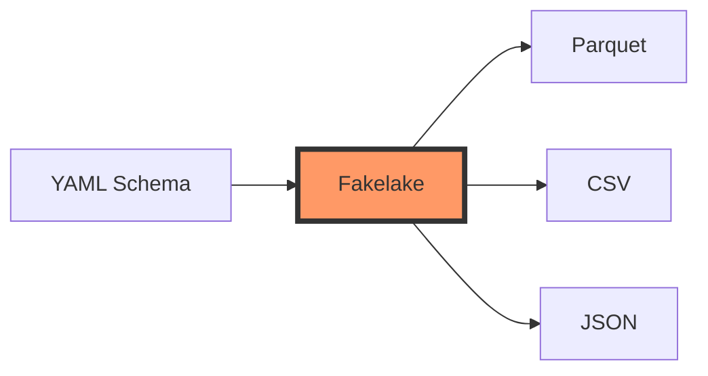

<p align="center">
  
</p>

<p align="center">
  <strong>⚡ Blazingly fast fake data generator powered by Rust</strong>
</p>

<p align="center">
  <a href="https://github.com/soma-smart/Fakelake/releases"></a>
  <a href="https://soma-smart.github.io/Fakelake/"></a>
  
  
  
  
</p>

---

## 🚀 Why Fakelake?

**Fakelake** is a lightning-fast command-line tool that generates realistic fake data from simple YAML configurations. Perfect for load testing, database seeding, development, and data pipeline testing.

### ✨ Key Highlights

- **Blazingly Fast**: Generate millions of rows in seconds - up to **53x faster** than Python alternatives
- **Lightweight**: Small binary size with minimal memory footprint
- **Simple**: Define your data schema in YAML, get results instantly
- **Reliable**: Written in pure Rust with zero unsafe code
- **Cross-platform**: Works seamlessly on Linux, macOS, and Windows
- **Multiple Formats**: Export to Parquet, CSV, or JSON
- **Reproducible**: Optional seed for deterministic data generation


---

## 🏗️ Use Cases

- **Load Testing**: Generate millions of realistic rows for database stress testing
- **Database Seeding**: Populate development/staging databases with realistic data
- **Data Pipeline Testing**: Test ETL processes with configurable data volumes
- **Analytics Development**: Create sample datasets for BI tool development
- **Learning & Training**: Generate datasets for SQL practice or data science tutorials
- **Data Quality Testing**: Use `corrupted` and `presence` options to test validation logic

---

## 📊 Performance Benchmark

Generate 1 million rows with random strings (10 characters):

| Tool | Time | Speed vs Fakelake |
|:-----|-----:|------------------:|
| **Fakelake** | **253 ms** | **1.00x** |
| Mimesis (Python) | 3,375 ms | 13.35x slower |
| Faker (Python) | 13,553 ms | 53.62x slower |

<details>
<summary>Benchmark Details</summary>

- **Environment**: AMD Ryzen 5 7530U, 8GB RAM, SSD
- **OS**: Windows
- **Test**: Generate 1M rows, single column with 10-character random strings
- **Command**: Run `scripts/benchmark.sh` to reproduce

</details>

---

## Quick Start

### Installation

#### Option 1: Download Precompiled Binary (Recommended)

Binaries are accessible from the [Releases](https://github.com/soma-smart/Fakelake/releases) page.
Or can be downloaded directly via command line:

```bash
# Download the latest release
wget https://github.com/soma-smart/Fakelake/releases/latest/download/Fakelake_<version>_<target>.tar.gz

# Extract and run
tar -xvf Fakelake_<version>_<target>.tar.gz
./fakelake --help
```

#### Option 2: Build from Source

```bash
git clone https://github.com/soma-smart/Fakelake.git
cd Fakelake
cargo build --release
./target/release/fakelake --help
```

---

## 💡 Usage

### Basic Example

Create a YAML file describing your data schema:

```yaml
columns:
  - name: user_id
    provider: Increment.integer
    start: 1

  - name: email
    provider: Person.email
    domain: example.com

  - name: signup_date
    provider: Random.Date.date
    format: "%Y-%m-%d"
    after: 2020-01-01
    before: 2024-12-31

info:
  output_name: users
  output_format: parquet
  rows: 1_000_000
```

Generate the data:

```bash
fakelake generate users.yaml
```

That's it! You'll get a `users.parquet` file with 1 million rows in seconds.

### Generate Multiple Files

```bash
fakelake generate schema1.yaml schema2.yaml schema3.yaml
```

---

## 🎯 Features & Capabilities

### 📦 Data Providers

Fakelake comes with rich built-in providers for generating realistic data:

[All Providers](https://soma-smart.github.io/Fakelake/columns/providers/) are listed in the documentation

#### **Increment**
```yaml
- name: id
  provider: Increment.integer
  start: 100      # Starting value (default: 0)
  step: 2         # Increment step (default: 1)
```

#### **Person**
```yaml
- name: first_name
  provider: Person.fname    # French first names (top 1000)

- name: last_name
  provider: Person.lname    # French last names (top 1000)

- name: email
  provider: Person.email
  domain: company.com       # Custom domain (default: example.com)
```

#### **Random Numbers**
```yaml
- name: score
  provider: Random.Number.i32
  min: 0
  max: 100

- name: percentage
  provider: Random.Number.f64
  min: 0.0
  max: 100.0
```

#### **Random Strings**
```yaml
- name: code
  provider: Random.String.alphanumeric
  length: 10         # Fixed length

- name: dynamic_code
  provider: Random.String.alphanumeric
  length: 5..15      # Variable length range
```

#### **Random Dates**
```yaml
- name: created_at
  provider: Random.Date.date
  format: "%Y-%m-%d"
  after: 2020-01-01
  before: 2024-12-31

- name: last_login
  provider: Random.Date.datetime
  format: "%Y-%m-%d %H:%M:%S"
  after: 2024-01-01 00:00:00
  before: 2024-12-31 23:59:59
```

#### **Random Boolean**
```yaml
- name: is_active
  provider: Random.bool
```

#### **Constant Values**
```yaml
# Single value
- name: country
  provider: Constant.string
  data: France

# List (random selection)
- name: status
  provider: Constant.string
  data: [active, inactive, pending]

# Weighted list (for data skewing)
- name: priority
  provider: Constant.string
  data:
    - value: low
      weight: 5
    - value: medium
      weight: 3
    - value: high
      weight: 1
```

#### **External Data**
```yaml
- name: product_name
  provider: Constant.external
  path: data/products.txt    # One value per line
```

### 🎛️ Column Options

[Column Options](https://soma-smart.github.io/Fakelake/columns/options/) are listed in the documentation.

#### **Presence** (Missing Values)
```yaml
- name: optional_field
  provider: Person.email
  presence: 0.8    # 80% filled, 20% missing (null)
```

#### **Corrupted** (Invalid Data)
```yaml
- name: email
  provider: Person.email
  corrupted: 0.01  # 1% of emails will be intentionally invalid
```
Useful for testing data validation and error handling!

### 📤 Output Formats

[Output Parameters](https://soma-smart.github.io/Fakelake/output/parameters/) are listed in the documentation.

#### **Parquet** (Default)
```yaml
info:
  output_format: parquet
```

#### **CSV**
```yaml
info:
  output_format: csv
  delimiter: ','    # Customizable delimiter
```

#### **JSON**
```yaml
info:
  output_format: json
  wrap_up: false    # false: JSONL (one object per line)
                    # true: Valid JSON array
```

### 🎲 Reproducible Data Generation

Use a seed for deterministic output:

```yaml
info:
  seed: 42          # Same seed = same data every time
  rows: 1_000_000
```

Perfect for testing, debugging, and consistent datasets!

---

## 📚 Complete Example

Here's a comprehensive example showcasing most features:

```yaml
columns:
  - name: id
    provider: Increment.integer
    start: 42
    step: 2
    presence: 0.8       # 80% present, 20% null

  - name: first_name
    provider: Person.fname

  - name: last_name
    provider: Person.lname

  - name: company_email
    provider: Person.email
    domain: soma-smart.com
    corrupted: 0.0001   # 0.01% corrupted emails

  - name: created
    provider: Random.Date.date
    format: "%Y-%m-%d"
    after: 2000-02-15
    before: 2020-07-17

  - name: connection
    provider: Random.Date.datetime
    format: "%Y-%m-%d %H:%M:%S"
    after: 2000-02-15 12:15:00
    before: 2020-07-17 23:11:57

  - name: code
    provider: Random.String.alphanumeric
    length: 20

  - name: code_variable
    provider: Random.String.alphanumeric
    length: 5..15       # Variable length

  - name: is_subscribed
    provider: Random.bool

  - name: score
    provider: Random.Number.i32
    min: -100
    max: 100

  - name: percentage
    provider: Random.Number.f64
    min: -1000
    max: 1000

  - name: constant_string
    provider: Constant.string
    data: my_constant

  - name: category
    provider: Constant.string
    data: [electronics, clothing, books]

  - name: priority
    provider: Constant.string
    data:
      - value: low
        weight: 5
      - value: high
        weight: 1

  - name: product_name
    provider: Constant.external
    path: tests/example.txt

info:
  output_name: target/comprehensive_example
  output_format: parquet
  rows: 174_957
  seed: 12345          # Reproducible data
```

---

## 🛠️ Built With


**Key Dependencies:**
- `arrow` & `parquet` - High-performance columnar data
- `fastrand` - Fast random number generation
- `rayon` - Parallel processing
- `chrono` - Date and time handling
- `clap` - Command-line interface

---

## 📖 Documentation

Full documentation is available at **[soma-smart.github.io/Fakelake](https://soma-smart.github.io/Fakelake/)**

- [Creating YAML Files](https://soma-smart.github.io/Fakelake/usage/create_your_yaml_file/)
- [All Providers](https://soma-smart.github.io/Fakelake/columns/providers/)
- [Column Options](https://soma-smart.github.io/Fakelake/columns/options/)
- [Output Parameters](https://soma-smart.github.io/Fakelake/output/parameters/)

---

## 🤝 Contributing

Contributions are welcome! Whether it's bug reports, feature requests, or code contributions.

1. Fork the Project
2. Create your Feature Branch (`git checkout -b feature/AmazingFeature`)
3. Commit your Changes (`git commit -m 'Add some AmazingFeature'`)
4. Push to the Branch (`git push origin feature/AmazingFeature`)
5. Open a Pull Request

---

## 📄 License

Distributed under the **MIT License**. See [`LICENSE.txt`](LICENSE.txt) for more information.

---

## 🏢 About

Fakelake is actively developed and maintained by **[SOMA](https://www.linkedin.com/company/soma-smart/)** in Paris.

**Any feedback is welcome!** Feel free to open an issue or start a discussion.
